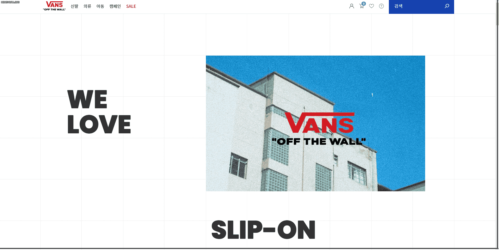
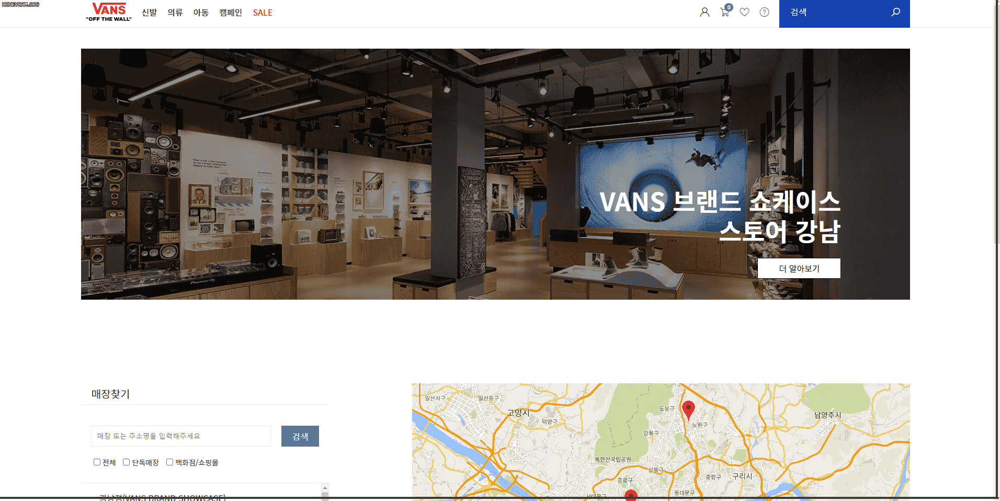
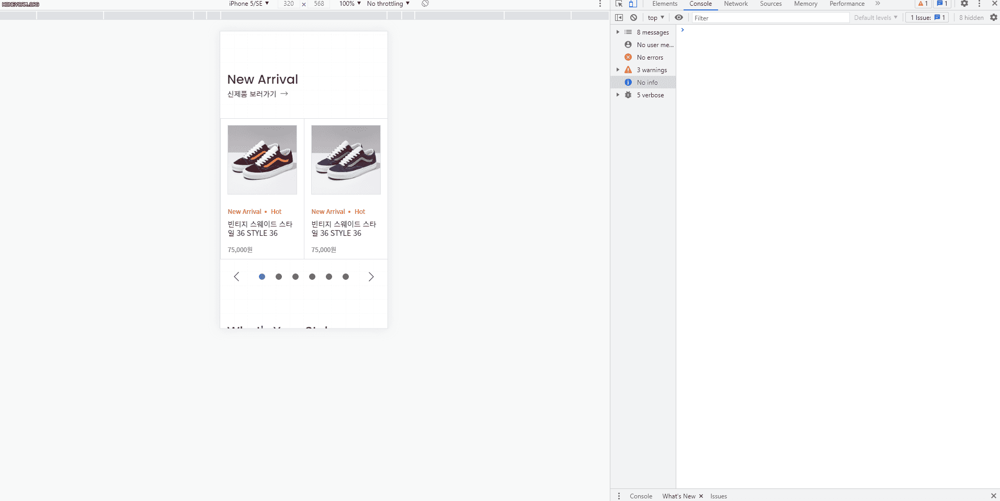

# 반스 리뉴얼

## 디자인 컨셉

`그 시절 우리가 사랑했던 반스` 를 컨셉으로 청량하면서도 서정적인 분위기를 연출하였습니다. 반스의 대표적인 아이템 체커보드를 연상시키는 격자무늬를 사이트 전반에 배치하여 브랜드 이미지를 전달하였습니다.

## Pages

- index




인덱스 페이지로 웹사이트의 컨셉을 표현하는 동시에 신제품, 인기상품, 켐페인, 뉴스 등 다양한 정보를 제공하는 페이지입니다.

- sub1



매장 찾기 페이지로 구글 맵스 API를 활용하여 사용자에게 매장 위치 정보를 제공합니다.

## 구현 기능

- 텍스트 외곽선 효과

  텍스트의 외곽선을 활용한 디자인을 구현해보았습니다. text-stroke를 사용하면 간단하게 텍스트 외곽선을 구현할 수 있지만 IE에서 지원되지 않는 속성이기 때문에 text-shadow를 사용하여 외곽선을 표현하였습니다.

1. text-stroke

```css
-webkit-text-stroke: 1px $color-grey-primary;
text-stroke: 1px $color-grey-primary;
```

2. text-shadow

```css
text-shadow: -1px -1px 0 $color-grey-primary, 1px -1px 0 $color-grey-primary,
  -1px 1px 0 $color-grey-primary, 1px 1px 0 $color-grey-primary;
```

- 스티키 효과

스크롤이 특정 위치에 도달하면 position : fixed 가 되었다가 특정 위치를 벗어나면 position : static이 되는 positon sticky 효과를 자바스크립트로 구현해보았습니다.

```java script
   if (scrollPos >= startPos && scrollPos < endPos) {
      activateFixed();
      fixedArea.style.transform = `translateY(0)`;
    } else {
      if (scrollPos < startPos) {
        inactivateFixed();
        fixedArea.style.transform = `translateY(0)`;
      }
      if (scrollPos > endPos) {
        inactivateFixed();
        fixedArea.style.transform = `translateY(${scrollRange}px)`;
      }
    }
```

- 구글 맵스 API

  구글 맵스 API를 사용하여 사용자에게 매장 위치 정보를 제공할 수 있도록 하였습니다.

## 반응형


데스크탑을 기준으로 디자인되었으며 `1200px` 미만 , `1024px` 미만, `768px` 미만을 분기로 반응형을 구현하였습니다.



수직으로 스크롤 하는 경향이 강화된 모바일 기기 사용자의 정보 탐색 방향을 고려하여 콘텐츠는 수직으로 배치하되 콘텐츠 안의 내용들은 수평으로 배치하였습니다.
